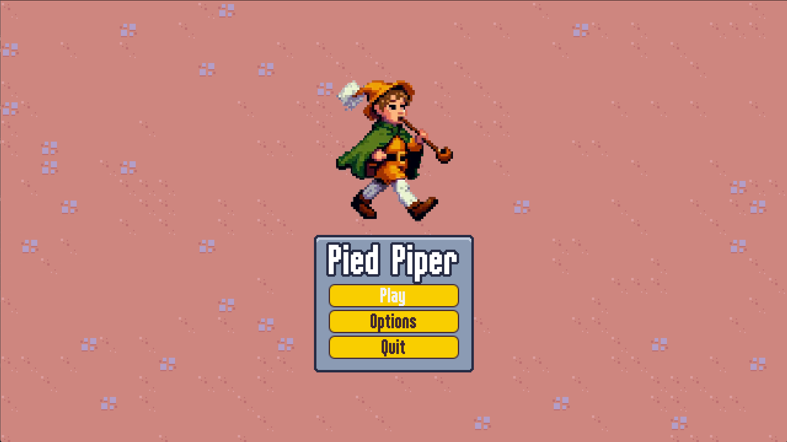
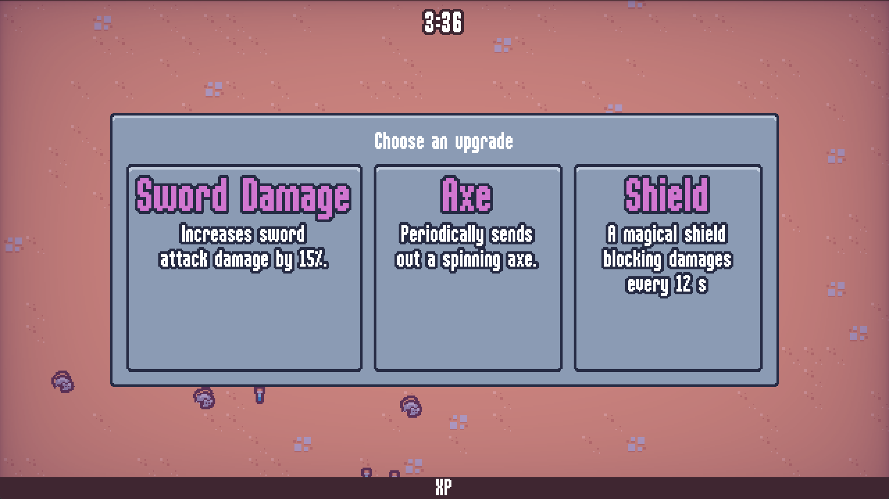

# Pied Piper

A simple vampire survivors clone developed in Godot. Mostly based on the course: [Create a Complete 2D Survivors Style Game in Godot 4](https://www.udemy.com/course/create-a-complete-2d-arena-survival-roguelike-game-in-godot-4)

[Play/Download](https://kemalb.itch.io/pied-piper)

## Screenshots

